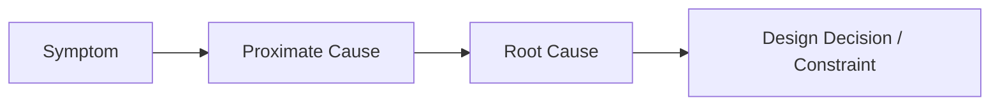
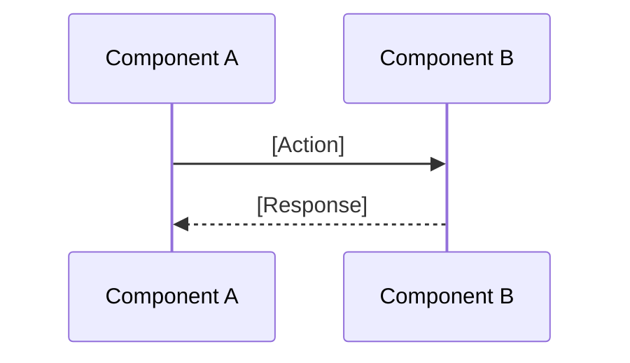

# Study Output Templates

Reference material for formatting technical study outputs. Select format based on complexity triage.

---

## Quick Verdict Format (Simple complexity only)

**Question:** [Restate the decision]

**Verdict:** [Proceed / Do Not Proceed] — [One sentence rationale]

**Recommendation:** [Specific action to take]

**Key considerations:**

- [Bullet 1]
- [Bullet 2]
- [Bullet 3]

**Caveats:** [Any risks or assumptions, or "None significant"]

**Design concerns considered:** [Brief note on key concerns checked — e.g., "No pattern violations; reuses existing X pattern" or "Accepted tradeoff: adds coupling to Y for simplicity"]

---

## Standard Report Format (Moderate/Complex)

# Technical Study: [Topic Name]

| Attribute       | Value                                                    |
| --------------- | -------------------------------------------------------- |
| Study Type      | Feature Design / Refactoring Strategy / Flaw Remediation |
| Complexity      | Simple / Moderate / Complex                              |
| Verdict         | Proceed / Proceed with Caveats / Do Not Proceed          |
| Confidence      | High / Medium / Low                                      |
| Risk Level      | Low / Medium / High / Critical                           |
| Effort Estimate | S / M / L / XL                                           |
| ROI Assessment  | High / Medium / Low / Negative                           |

---

## 1. Summary

- **Problem/Goal:** [One sentence: what are we solving or building?]
- **Verdict:** [Why proceed or not]
- **Key Constraint:** [The single biggest blocker or concern]
- **Recommendation:** `**[DECISION]**: [Action] — [Rationale]`

---

## 2. Context Validation

_Was sufficient context available to produce this study?_

| Area               | Status                           | Notes     |
| ------------------ | -------------------------------- | --------- |
| Problem scope      | ✅ Clear / ⚠️ Assumed / ❓ Asked | [Details] |
| Constraints        | ✅ Clear / ⚠️ Assumed / ❓ Asked | [Details] |
| Existing solutions | ✅ Found / ⚠️ None found         | [Details] |
| Priorities         | ✅ Clear / ⚠️ Assumed            | [Details] |

**Questions asked:** [List any clarifying questions that were needed]

---

## 3. Industry Context & Standards

_Benchmarking against external best practices._

| Category | Standard / Pattern           | Relevance      | Alignment           | Source |
| -------- | ---------------------------- | -------------- | ------------------- | ------ |
| Pattern  | e.g., Circuit Breaker        | [Why relevant] | ✅ Aligned / ⚠️ Gap | [Link] |
| Security | e.g., OWASP Input Validation | [Why relevant] | ✅ Aligned / ⚠️ Gap | [Link] |
| Library  | e.g., Pydantic vs Custom     | [Comparison]   | [Recommendation]    | [Link] |

**Insight:** [How does the industry solve this vs. what we're proposing?]

---

## 4. Leverage Assessment

_What existing assets can we use?_

| Asset              | Location            | Reusability         | Notes           |
| ------------------ | ------------------- | ------------------- | --------------- |
| [Existing pattern] | `path/to/file.py`   | High / Medium / Low | [How to extend] |
| [Related code]     | `path/to/module.ts` | High / Medium / Low | [Gap analysis]  |

**Verdict:** [Build new / Extend existing / Use library]

---

## 5. Codebase Analysis

_Current state of relevant code._

| Area        | Location                 | Current Behavior | Relevance        |
| ----------- | ------------------------ | ---------------- | ---------------- |
| [Component] | `path/to/file.py:L10-50` | [What it does]   | [Why it matters] |

**Key References:**

- `function_name()` in [path/to/module.py](path/to/module.py#L42) — [description]
- Related tests: [path/to/test_file.py](path/to/test_file.py)

---

## 6. Findings

### 6.1 Current Issues (if any)

| Issue        | Location         | Severity | Description    |
| ------------ | ---------------- | -------- | -------------- |
| `[DEBT]`     | `module.py:L100` | Medium   | [What's wrong] |
| `[SECURITY]` | `service.ts:L50` | High     | [Concern]      |

### 6.2 Root Cause Analysis (for Flaw studies)

- **Symptom:** [What user/system experiences]
- **Proximate Cause:** [Immediate technical reason]
- **Root Cause:** [Underlying design flaw]

### 6.3 Change Risks

| Risk          | Type            | Severity | Mitigation      |
| ------------- | --------------- | -------- | --------------- |
| [Description] | `[SECURITY]`    | High     | [Prevention]    |
| [Description] | `[PORTABILITY]` | Medium   | [Exit strategy] |

---

## 7. Solution Options

| Option              | Description | Pros       | Cons             | Effort | Portability  |
| ------------------- | ----------- | ---------- | ---------------- | ------ | ------------ |
| **A (Recommended)** | [Approach]  | [Benefits] | [Drawbacks]      | M      | High/Med/Low |
| B                   | [Approach]  | [Benefits] | [Drawbacks]      | L      | High/Med/Low |
| C (Do Nothing)      | Status quo  | No effort  | Problem persists | -      | N/A          |

**Selection rationale:** `**[DECISION]**: [Choice] — [Why this over alternatives]`

---

## 8. Design Stress Test

_Adversarial evaluation of the recommended solution against design concerns._

### Concerns Evaluated

| Concern             | Assessment                                 | Status                 |
| ------------------- | ------------------------------------------ | ---------------------- |
| Architectural drift | [Does this align with codebase direction?] | ✅ Clear / ⚠️ Tradeoff |
| Pattern violations  | [What conventions affected?]               | ✅ Clear / ⚠️ Tradeoff |
| Reinvented wheels   | [What existing solutions were considered?] | ✅ Clear / ⚠️ Tradeoff |
| Abstraction level   | [Right level? What might leak?]            | ✅ Clear / ⚠️ Tradeoff |
| Coupling            | [New dependencies appropriate?]            | ✅ Clear / ⚠️ Tradeoff |
| API surface         | [Interface clarity and consistency?]       | ✅ Clear / ⚠️ Tradeoff |
| Complexity match    | [Proportionate to problem?]                | ✅ Clear / ⚠️ Tradeoff |

_Remove rows that don't apply. Add detail only for ⚠️ Tradeoff items._

### Accepted Tradeoffs

_Document any concerns marked as tradeoffs above. Explain why accepted and any mitigations._

- **[Concern]**: [Why this tradeoff is acceptable. What mitigation exists, if any. Known limitations.]

_If no tradeoffs: "None — solution aligns with all design concerns evaluated."_

---

## 9. Portability & Exit Strategy

_For recommended solution with external dependencies._

| Dependency        | Lock-in Risk        | Abstraction Strategy        | Migration Path  |
| ----------------- | ------------------- | --------------------------- | --------------- |
| [Library/Service] | High / Medium / Low | [Interface/Adapter pattern] | [How to switch] |

---

## 10. Implementation Sketch

_High-level approach (not full implementation)._

### 10.1 Affected Areas

- [ ] `path/to/module.py` — [change needed]
- [ ] `path/to/service.ts` — [change needed]
- [ ] Tests: `path/to/test.py` — [new/updated tests]

### 10.2 Sequence / Flow (if applicable)

---

## 11. Dependencies & Assumptions

**Assumptions:**

- [Assumption about codebase, environment, or requirements]

**Dependencies:**

- [Blocking work, external services, or team coordination]

---

## 12. Next Steps

| Action          | Owner         | Priority |
| --------------- | ------------- | -------- |
| [Specific task] | [Team/Person] | P0       |
| [Specific task] | [Team/Person] | P1       |

**Open Questions:**

- [What still needs clarification?]
