# Backend Testing Guide

**Version**: 3.0.0
**Date**: November 6, 2025
**Status**: ✅ Current Reference

---

## Overview

This guide helps you extend and maintain the backend testing suite. The backend uses pytest with async support for testing modular FastAPI applications with WebSocket endpoints.

**Quick Navigation:**

- 🚀 **New to testing?** → Start with [Quick Start](#quick-start)
- ➕ **Adding tests?** → Jump to [Adding New Tests](#adding-new-tests)
- 🐛 **Tests failing?** → Check [Troubleshooting](#troubleshooting)
- 🏃 **Running tests?** → See [Running Tests](#running-tests)
- 📚 **Understanding internals?** → Read [Understanding the System](#understanding-the-system)

---

## Table of Contents

1. [Quick Start](#quick-start)
2. [Running Tests](#running-tests)
3. [Test Organization](#test-organization)
4. [Adding New Tests](#adding-new-tests)
5. [Testing Patterns](#testing-patterns)
6. [Troubleshooting](#troubleshooting)
7. [Understanding the System](#understanding-the-system)
8. [Reference](#reference)
9. [Related Documentation](#related-documentation)

---

## Quick Start

### I want to...

| Task                    | Command                                   | Section                                               |
| ----------------------- | ----------------------------------------- | ----------------------------------------------------- |
| Run all tests           | `make test`                               | [Running Tests](#running-tests)                       |
| Run unit tests only     | `make test-modules`                       | [Running Tests](#running-tests)                       |
| Run integration tests   | `make test-integration`                   | [Running Tests](#running-tests)                       |
| Add a module unit test  | See template below                        | [Adding Unit Tests](#adding-unit-tests)               |
| Add an integration test | See template below                        | [Adding-integration-tests](#adding-integration-tests) |
| Debug a failing test    | `poetry run pytest path/to/test.py -v -s` | [Troubleshooting](#troubleshooting)                   |
| Check test coverage     | `make test-cov`                           | [Running Tests](#running-tests)                       |

### Quick Test Template (Unit Test)

```python
# backend/src/trading_api/modules/broker/tests/test_my_feature.py
import pytest
from httpx import AsyncClient

@pytest.mark.asyncio
async def test_my_endpoint(async_client: AsyncClient) -> None:
    """Test my new endpoint."""
    response = await async_client.get("/api/v1/broker/my-endpoint")

    assert response.status_code == 200
    data = response.json()
    assert "expected_field" in data
```

Run it: `make test-module-broker`

### Quick Test Template (Integration Test)

```python
# backend/tests/integration/test_my_integration.py
import pytest
from trading_api.app_factory import ModularApp

@pytest.mark.asyncio
async def test_my_workflow(broker_only_app: ModularApp):
    """Test cross-module workflow."""
    async with AsyncClient(app=broker_only_app, base_url="http://test") as client:
        response = await client.get("/api/v1/broker/accounts")
        assert response.status_code == 200
```

Run it: `make test-integration`

---

## Running Tests

---

## Running Tests

### All Tests

```bash
# Run everything (boundaries + unit + integration)
make test

# Run with coverage report
make test-cov
```

### By Test Level

```bash
# Root-level architectural tests
make test-boundaries

# All module unit tests
make test-modules

# Integration tests only
make test-integration
```

### Specific Module Tests

```bash
# Auto-discovered module targets
make test-module-broker
make test-module-datafeed

# Run specific module with custom selection
make test-modules modules=broker,datafeed
```

### Specific Test Files or Functions

```bash
# Run specific test file
poetry run pytest tests/integration/test_module_isolation.py -v

# Run specific test function
poetry run pytest tests/integration/test_module_isolation.py::TestModuleIsolation::test_broker_only_app -v

# Run with verbose output and print statements
poetry run pytest path/to/test.py -v -s

# Stop on first failure
poetry run pytest path/to/test.py -x
```

### Test Discovery

Pytest automatically discovers tests in:

- `backend/tests/` - Root-level tests
- `backend/tests/unit/` - Backend manager unit tests
- `backend/tests/integration/` - Integration tests
- `backend/src/trading_api/modules/*/tests/` - Module-specific tests

### Performance Targets

- **Unit tests**: < 100ms each
- **Module test suite**: < 5 seconds
- **Integration tests**: < 1 minute total
- **Full test suite**: < 2 minutes

---

## Test Organization

The backend has a four-tier test structure:

### 1. Root-Level Tests (`backend/tests/`)

Located in `backend/tests/`, these tests validate cross-cutting concerns:

```
backend/tests/
├── conftest.py                     # Shared fixtures for all tests
├── test_import_boundaries.py       # Module isolation validation
├── test_module_registry.py         # Module discovery and registration
├── test_deployment_config.py       # Configuration validation
├── unit/                           # Backend manager unit tests
└── integration/                    # Integration tests (see below)
```

**Purpose:**

- ✅ Validate module boundaries and import rules
- ✅ Test module registry and discovery
- ✅ Verify deployment configuration
- ✅ Ensure architectural constraints

**Run with:**

```bash
make test-boundaries
```

### 2. Backend Manager Unit Tests (`backend/tests/unit/`)

Backend manager unit tests validate configuration and logic without starting real processes:

```
backend/tests/unit/
├── test_backend_manager_config.py        # Configuration loading and validation
├── test_backend_manager_nginx_config.py  # Nginx configuration generation
├── test_backend_manager_pid_files.py     # PID file management
└── test_backend_manager_port_management.py # Port allocation logic
```

**Purpose:**

- ✅ Test backend manager configuration loading
- ✅ Validate nginx configuration generation
- ✅ Test PID file management logic
- ✅ Verify port allocation and management
- ✅ Fast execution with no real processes

**Run with:**

```bash
poetry run pytest tests/unit/ -v -m unit
```

### 3. Module Unit Tests (`modules/*/tests/`)

Each module has its own test directory for fast, isolated tests:

```
backend/src/trading_api/modules/
├── broker/
│   └── tests/
│       ├── test_api_broker.py      # Broker API tests
│       └── test_ws_broker.py       # Broker WebSocket tests
└── datafeed/
    └── tests/
        └── test_ws_datafeed.py     # Datafeed WebSocket tests
```

**Purpose:**

- ✅ Test module-specific endpoints and logic
- ✅ Fast execution with isolated fixtures (< 100ms per test)
- ✅ Use AsyncClient/TestClient for synchronous testing
- ✅ No external dependencies or HTTP servers

**Key characteristics:**

- Use `async_client` fixture for REST API tests
- Use `client` fixture for WebSocket tests
- Tests against FastAPI TestClient (no real HTTP server)
- No database or external dependencies

**Run with:**

```bash
# All module tests
make test-modules

# Specific module
make test-module-broker
make test-module-datafeed

# With verbose output
poetry run pytest src/trading_api/modules/broker/tests/ -v
```

### 4. Integration Tests (`backend/tests/integration/`)

Located in `backend/tests/integration/`, these tests verify system integration with real HTTP servers and multi-process communication:

```
backend/tests/integration/
├── conftest.py                           # Integration fixtures
├── test_backend_manager_integration.py   # Multi-process backend testing
├── test_module_isolation.py              # Module isolation verification
├── test_broker_datafeed_workflow.py      # End-to-end workflows
└── test_full_stack.py                    # Full stack integration
```

**Purpose:**

- ✅ Test multi-process server management
- ✅ Verify nginx routing and load balancing
- ✅ Test cross-module communication
- ✅ End-to-end workflow validation
- ✅ Real HTTP and WebSocket connections

**Key characteristics:**

- Use session-scoped fixtures for efficiency
- Real uvicorn servers with nginx
- Test backend manager orchestration
- Comprehensive cleanup to prevent leaks

**Run with:**

```bash
make test-integration
```

---

## Adding New Tests

### Decision Tree: What Type of Test?

```
Is it testing a single module's endpoint or logic?
├─ YES → Unit Test (modules/<module>/tests/)
│         - Fast execution with TestClient
│         - No external dependencies
│         - Go to: Adding Unit Tests
│
└─ NO → Is it testing cross-module communication or multi-process?
         ├─ YES → Integration Test (tests/integration/)
         │         - Real HTTP/WebSocket connections
         │         - Tests nginx routing or workflows
         │         - Go to: Adding Integration Tests
         │
         └─ NO → Is it testing architectural constraints?
                  └─ YES → Boundary Test (tests/)
                            - Module isolation
                            - Import rules
                            - Configuration validation
```

### Adding Unit Tests

**Step 1: Choose the right location**

```
backend/src/trading_api/modules/<module>/tests/
├── test_api_<module>.py      # REST API endpoint tests
├── test_ws_<module>.py        # WebSocket tests
└── test_<feature>.py          # Feature-specific tests
```

**Step 2: Use the template**

```python
# backend/src/trading_api/modules/broker/tests/test_orders.py
import pytest
from httpx import AsyncClient

class TestBrokerOrders:
    """Test broker order endpoints."""

    @pytest.mark.asyncio
    async def test_get_orders(self, async_client: AsyncClient) -> None:
        """Test fetching orders."""
        response = await async_client.get("/api/v1/broker/orders")

        assert response.status_code == 200
        data = response.json()
        assert isinstance(data, list)

    @pytest.mark.asyncio
    async def test_place_order(self, async_client: AsyncClient) -> None:
        """Test placing an order."""
        order_data = {
            "symbol": "AAPL",
            "qty": 100,
            "side": "buy"
        }

        response = await async_client.post(
            "/api/v1/broker/orders",
            json=order_data
        )

        assert response.status_code == 201
        data = response.json()
        assert data["symbol"] == "AAPL"
        assert data["qty"] == 100
```

**Step 3: WebSocket unit test template**

```python
# backend/src/trading_api/modules/datafeed/tests/test_ws_quotes.py
from fastapi.testclient import TestClient

def test_subscribe_to_quotes(client: TestClient) -> None:
    """Test subscribing to quote updates."""
    with client.websocket_connect("/api/v1/datafeed/ws") as websocket:
        # Send subscription
        websocket.send_json({
            "type": "quotes.subscribe",
            "payload": {"symbols": ["AAPL", "GOOGL"]}
        })

        # Verify response
        response = websocket.receive_json()
        assert response["type"] == "quotes.subscribe.response"
        assert response["payload"]["success"] is True

        # Verify updates
        quote = websocket.receive_json()
        assert quote["type"] == "quotes.update"
        assert quote["payload"]["symbol"] in ["AAPL", "GOOGL"]
```

**Step 4: Run your tests**

```bash
# Run just your module
make test-module-broker

# Run with verbose output
poetry run pytest src/trading_api/modules/broker/tests/test_orders.py -v

# Run specific test
poetry run pytest src/trading_api/modules/broker/tests/test_orders.py::TestBrokerOrders::test_get_orders -v
```

**Step 5: Verify with coverage**

```bash
poetry run pytest src/trading_api/modules/broker/tests/ \
    --cov=trading_api.modules.broker \
    --cov-report=term-missing
```

### Adding Integration Tests

Integration tests verify multi-process communication, nginx routing, and cross-module workflows.

**When to add integration tests:**

- Testing communication between modules
- Testing nginx routing and load balancing
- Testing multi-process server management
- End-to-end workflow validation

**Step 1: Determine test category**

```python
# Option A: Module isolation test
# Location: tests/integration/test_module_isolation.py
# Tests that modules can run independently

@pytest.mark.asyncio
async def test_broker_isolation(broker_only_app: ModularApp):
    """Test broker-only app has no datafeed endpoints."""
    async with AsyncClient(app=broker_only_app, base_url="http://test") as client:
        # Broker available
        response = await client.get("/api/v1/broker/accounts")
        assert response.status_code == 200

        # Datafeed NOT available
        response = await client.get("/api/v1/datafeed/symbols")
        assert response.status_code == 404
```

```python
# Option B: Backend manager test
# Location: tests/integration/test_backend_manager_integration.py
# Tests multi-process server orchestration

async def test_XX_nginx_routing(
    self, session_backend_manager: ServerManager
) -> None:
    """Test nginx routes requests to backend servers."""
    await ensure_started(session_backend_manager)

    nginx_port = session_backend_manager.config.nginx.port

    async with httpx.AsyncClient() as client:
        response = await client.get(
            f"http://127.0.0.1:{nginx_port}/api/v1/broker/accounts",
            timeout=5.0
        )
        assert response.status_code == 200
```

```python
# Option C: Cross-service workflow test
# Location: tests/integration/test_broker_datafeed_workflow.py
# Tests end-to-end workflows

@pytest.mark.asyncio
async def test_order_with_market_data(broker_service, datafeed_service):
    """Test placing order with live market data."""
    async with AsyncClient() as client:
        # Get current price from datafeed
        price_response = await client.get(
            f"{datafeed_service}/api/v1/datafeed/quotes/AAPL"
        )
        current_price = price_response.json()["price"]

        # Place order at current price
        order_response = await client.post(
            f"{broker_service}/api/v1/broker/orders",
            json={"symbol": "AAPL", "price": current_price}
        )
        assert order_response.status_code == 201
```

**Step 2: Choose appropriate fixtures**

```python
# For backend manager tests: Use session backend
async def test_XX_my_test(
    self, session_backend_manager: ServerManager
) -> None:
    await ensure_started(session_backend_manager)
    # Test logic using shared session backend

# For module isolation: Use module-specific app
async def test_isolation(broker_only_app: ModularApp):
    async with AsyncClient(app=broker_only_app, base_url="http://test") as client:
        # Test logic

# For unique configurations: Use tmp_path
async def test_custom_config(tmp_path: Path):
    config = DeploymentConfig(...)  # Custom config
    manager = ServerManager(config, ...)
    # Test logic with isolated instance
```

**Step 3: Follow test organization**

For backend manager tests, follow the numbered convention:

```python
class TestBackendManagerIntegration:
    # Phase 1: Initial verification (01-05)
    async def test_01_initial_startup(...):
    async def test_02_health_checks(...):

    # Phase 2: Routing and functionality (06-10)
    async def test_06_nginx_routing(...):
    async def test_07_module_endpoints(...):

    # Phase 3: State mutations (11-14)
    async def test_11_restart_servers(...):

    # Phase 4: Destructive operations (15-18)
    async def test_15_stop_all(...):

    # Phase 5: Isolated tests (19+)
    async def test_19_custom_ports(self, tmp_path):
```

**Step 4: Run integration tests**

```bash
# All integration tests
make test-integration

# Specific file
poetry run pytest tests/integration/test_module_isolation.py -v

# With output visible
poetry run pytest tests/integration/ -v -s
```

### Adding Boundary Tests

Boundary tests validate architectural constraints.

```python
# backend/tests/test_module_boundaries.py
def test_broker_doesnt_import_datafeed():
    """Verify broker module doesn't import datafeed internals."""
    from trading_api.modules.broker import api

    import sys
    assert "trading_api.modules.datafeed.services" not in sys.modules
```

### Test Checklist

Before submitting your test:

- [ ] Test has clear, descriptive name
- [ ] Test has docstring explaining what it tests
- [ ] Test uses appropriate fixtures
- [ ] Test is independent (doesn't rely on execution order)
- [ ] Test cleans up resources (if creating new instances)
- [ ] Test passes when run alone: `pytest path/to/test.py::test_name`
- [ ] Test passes in full suite: `make test`
- [ ] Code follows existing patterns in the test file

---

## Testing Patterns

### Available Fixtures

**Session-scoped (shared across all tests):**

```python
@pytest.fixture(scope="session")
def apps() -> ModularApp:
    """Full application with all modules enabled."""
    return create_test_app()

@pytest.fixture(scope="session")
def broker_only_app() -> ModularApp:
    """Application with only broker module."""
    return create_test_app(enabled_modules=["broker"])

@pytest.fixture(scope="session")
def datafeed_only_app() -> ModularApp:
    """Application with only datafeed module."""
    return create_test_app(enabled_modules=["datafeed"])

@pytest.fixture(scope="session")
def no_modules_app() -> ModularApp:
    """Application with no modules."""
    return create_test_app(enabled_modules=[])
```

**Function-scoped (new instance per test):**

```python
@pytest.fixture
async def async_client(app: FastAPI) -> AsyncGenerator[AsyncClient, None]:
    """Async HTTP client for API tests."""
    async with AsyncClient(app=app, base_url="http://test") as ac:
        yield ac

@pytest.fixture
def client(app: FastAPI) -> TestClient:
    """Sync test client for WebSocket tests."""
    return TestClient(app)
```

### Event Loop Fixture for Session-Scoped Async Tests

**CRITICAL**: When using session-scoped async fixtures (like `apps`, `app`, `ws_apps`), you **MUST** define a session-scoped `event_loop` fixture to prevent event loop teardown issues.

```python
import asyncio
from collections.abc import Generator

import pytest


@pytest.fixture(scope="session")
def event_loop() -> Generator[asyncio.AbstractEventLoop, None, None]:
    """Create event loop for session-scoped async fixtures.

    Required for pytest-asyncio 0.21.x with session-scoped async fixtures.
    Without this, you'll get:
    - "ScopeMismatch: You tried to access the function scoped fixture
       event_loop with a session scoped request object"
    - "RuntimeWarning: coroutine 'async_finalizer' was never awaited"
       during test teardown
    """
    policy = asyncio.get_event_loop_policy()
    loop = policy.new_event_loop()
    yield loop
```

**Where to define this:**

- ✅ `backend/src/trading_api/conftest.py` - For module tests
- ✅ `backend/tests/integration/conftest.py` - For integration tests
- ✅ Any conftest.py with session-scoped async fixtures

**Why this is needed:**

- pytest-asyncio creates a **function-scoped** event loop by default
- Session-scoped async fixtures need a **session-scoped** event loop
- Without this, async cleanup (like closing async generators) fails
- Prevents CI failures with "Event loop is closed" errors

**Symptoms of missing event_loop fixture:**

- Tests pass locally but fail in CI
- RuntimeWarning about unawaited coroutines
- "Event loop is closed" errors during teardown
- DeprecationWarning about unclosed event loops

### Session-Based Testing Pattern

Integration tests use session-scoped fixtures to minimize overhead:

```python
@pytest_asyncio.fixture(scope="session")
async def session_backend_manager(...) -> AsyncGenerator[ServerManager, None]:
    """Start backend once for entire test session."""
    manager = ServerManager(...)

    # Start once
    success = await manager.start_all()
    if not success:
        raise RuntimeError("Failed to start backend")

    yield manager  # All tests share this instance

    # Cleanup once at end
    await _ensure_all_processes_killed(manager)
```

**Benefits:**

- ✅ Start backend once (10-15 seconds) instead of per test
- ✅ Share across multiple tests
- ✅ Automatic cleanup at session end
- ✅ 75% faster integration test execution

### Test Autonomy with `ensure_started()`

Each test should be autonomous and verify backend state:

```python
async def ensure_started(manager: ServerManager) -> None:
    """Ensure backend is fully started and healthy.

    Checks status and restarts if needed. Makes tests autonomous.
    """
    status = await manager.get_status()

    # If healthy, return early
    if status["running"] and status["nginx"]["healthy"]:
        all_healthy = all(
            inst["healthy"] for server in status["servers"].values()
            for inst in server
        )
        if all_healthy:
            return

    # Need restart
    manager._shutdown_requested = False
    await manager.stop_all(timeout=2.0)
    await asyncio.sleep(0.5)

    manager.processes.clear()
    manager.nginx_process = None

    success = await manager.start_all()
    if not success:
        raise RuntimeError("Failed to start backend")
```

**Usage:**

```python
async def test_my_feature(self, session_backend_manager: ServerManager):
    """Test description."""
    await ensure_started(session_backend_manager)  # Ensure ready

    # Test logic - backend is guaranteed running
```

**When to use:**

- ✅ After destructive operations (stop/restart tests)
- ✅ When test order is uncertain
- ✅ For test isolation and resilience
- ❌ Not needed for pure read-only operations
- ❌ Not needed for non-backend-manager tests

### Module Isolation Pattern

Test modules independently with selective loading:

```python
from trading_api.shared.tests.conftest import create_test_app

def test_datafeed_only():
    """Test with only datafeed module enabled."""
    app = create_test_app(enabled_modules=["datafeed"])

    async with AsyncClient(app=app, base_url="http://test") as client:
        # datafeed endpoints available
        response = await client.get("/api/v1/datafeed/symbols")
        assert response.status_code == 200

        # broker endpoints NOT available
        response = await client.get("/api/v1/broker/accounts")
        assert response.status_code == 404
```

### Creating Isolated Test Apps

```python
# All modules
app = create_test_app()

# Specific modules only
app = create_test_app(enabled_modules=["broker", "datafeed"])

# No modules
app = create_test_app(enabled_modules=[])
```

---

## Troubleshooting

### Common Issues and Solutions

#### Port Conflicts

**Symptom:** `address already in use` error

**Diagnosis:**

```bash
# Check what's using the port
lsof -i :19720
lsof -i :8000
```

**Solutions:**

```bash
# Kill development server
make kill-dev

# Kill all backend processes
pkill -f uvicorn

# Check for leaked processes after tests
lsof -i :19720  # Should be empty
```

**Prevention:**

- Always use cleanup fixtures
- Use unique ports for isolated tests
- Run `make kill-dev` before test runs

#### Test Order Dependency

**Symptom:** Tests pass individually but fail when run together

**Diagnosis:**

```bash
# Run tests in different orders
poetry run pytest tests/integration/ -v
poetry run pytest tests/integration/ -v --reverse
```

**Solutions:**

- Add `ensure_started()` to each backend manager test
- Don't assume server state
- Use function-scoped fixtures for mutable state
- Avoid global state modifications

**Example fix:**

```python
# Bad - assumes server is running
async def test_something(self, session_backend_manager):
    response = await client.get(...)  # May fail if previous test stopped server

# Good - ensures server is ready
async def test_something(self, session_backend_manager):
    await ensure_started(session_backend_manager)  # Always check first
    response = await client.get(...)
```

#### Slow Test Feedback

**Symptom:** Tests take too long during development

**Solutions:**

```bash
# Run specific test only
poetry run pytest tests/integration/test_backend_manager_integration.py::TestBackendManagerIntegration::test_06_broker_routes -v

# Stop on first failure
poetry run pytest tests/integration/ -x

# Run only unit tests (fast)
make test-modules

# Skip slow tests
poetry run pytest -m "not slow"
```

**Mark slow tests:**

```python
@pytest.mark.slow
async def test_long_running_operation():
    ...
```

#### Flaky Tests

**Symptom:** Tests pass/fail randomly

**Common causes:**

1. **Insufficient waits** - Async operations not complete
2. **Race conditions** - Timing-dependent code
3. **Shared state** - Tests interfering with each other
4. **Resource leaks** - Ports/processes not cleaned up

**Solutions:**

```python
# Bad - hardcoded sleep
await asyncio.sleep(1)  # May not be enough

# Good - wait for health check
async def wait_for_healthy(manager):
    for _ in range(10):
        status = await manager.get_status()
        if status["nginx"]["healthy"]:
            return
        await asyncio.sleep(0.5)
    raise TimeoutError("Backend not healthy")

# Use in test
await wait_for_healthy(session_backend_manager)
```

#### Import Errors After Code Generation

**Symptom:** `ModuleNotFoundError` for generated clients

**Diagnosis:**

```bash
# Check if generated files exist
ls -la src/trading_api/modules/broker/client_generated/
ls -la src/trading_api/modules/broker/specs_generated/
```

**Solutions:**

```bash
# Clean and regenerate
make clean-generated
make generate

# For specific module
make generate modules=broker

# Restart language server in VS Code
Ctrl+Shift+P → "Python: Restart Language Server"
```

### Debugging Tests

#### Run with Verbose Output

```bash
# Show test names and output
poetry run pytest tests/integration/ -v -s

# Show local variables on failure
poetry run pytest tests/integration/ -v -l

# Enter debugger on failure
poetry run pytest tests/integration/ --pdb
```

#### Check Logs

```bash
# Backend manager logs
tail -f .local/logs/*.log

# Nginx logs
tail -f .local/logs/nginx-*.log

# Clean logs
make logs-clean
```

#### Inspect Test State

```python
# Add debug output in test
async def test_something(self, session_backend_manager):
    await ensure_started(session_backend_manager)

    status = await session_backend_manager.get_status()
    print(f"Status: {status}")  # Visible with -s flag

    import pdb; pdb.set_trace()  # Interactive debugger
```

#### Test Specific Component

```bash
# Test only broker module
make test-module-broker

# Test specific integration category
poetry run pytest tests/integration/test_module_isolation.py -v

# Test with coverage to find untested code
poetry run pytest tests/integration/ --cov=trading_api --cov-report=html
open htmlcov/index.html
```

### Performance Debugging

#### Find Slow Tests

```bash
# Show test durations
poetry run pytest tests/integration/ -v --durations=10

# Profile test execution
poetry run pytest tests/integration/ --profile
```

#### Optimize Slow Tests

1. **Use session fixtures** for expensive setup
2. **Parallelize independent operations** (but not for backend manager)
3. **Mock external dependencies** when possible
4. **Use smaller test datasets**
5. **Cache expensive computations**

---

## Understanding the System

This section provides deeper insight into how the testing system works.

### App Startup Flow

Understanding the application startup flow is crucial for writing effective tests. This diagram shows the initialization sequence, including automatic code generation:

```mermaid
flowchart TB
    Start([Application Start]) --> LoadConfig[Load Configuration<br/>DeploymentConfig]
    LoadConfig --> CreateFactory[Create AppFactory]
    CreateFactory --> Discover[Auto-discover Modules<br/>from modules/]

    Discover --> Register[Register Modules<br/>in ModuleRegistry]
    Register --> Filter{Filter Enabled<br/>Modules}

    Filter --> EnabledModules[Get Enabled Modules]

    EnabledModules --> CreateModular[Create ModularApp]

    CreateModular --> InitModules[Initialize Each Module]

    InitModules --> CreateApp[Module.create_app]
    CreateApp --> Lifespan{Enter Lifespan<br/>Event}

    Lifespan --> GenSpecs[Generate OpenAPI Spec<br/>from FastAPI routes]
    GenSpecs --> CompareSpecs{Compare with<br/>Existing Spec}

    CompareSpecs -->|Changes Detected| WriteSpec[Write OpenAPI JSON<br/>to specs_generated/]
    CompareSpecs -->|No Changes| SkipGen[Skip Generation]

    WriteSpec --> GenClient[Generate Python Client<br/>from OpenAPI spec]
    GenClient --> FormatClient[Format Generated Code<br/>autoflake, black, isort]
    FormatClient --> UpdateIndex[Update __init__.py<br/>in client_generated/]

    UpdateIndex --> CheckWS{Has WebSocket<br/>App?}
    SkipGen --> CheckWS

    CheckWS -->|Yes| GenAsyncAPI[Generate AsyncAPI Spec<br/>from WS routes]
    CheckWS -->|No| MountModule

    GenAsyncAPI --> WriteAsyncAPI[Write AsyncAPI JSON<br/>to specs_generated/]
    WriteAsyncAPI --> SetupWS[Setup FastWSAdapter<br/>ws_app.setup]

    SetupWS --> MountModule[Mount Module at<br/>/api/v1/module_name]

    MountModule --> NextModule{More<br/>Modules?}
    NextModule -->|Yes| InitModules
    NextModule -->|No| AddMiddleware[Add CORS Middleware]

    AddMiddleware --> MergeSpecs[Merge All Module Specs<br/>into ModularApp]
    MergeSpecs --> ValidateModels[Validate Response Models<br/>for OpenAPI compliance]

    ValidateModels --> Ready([Application Ready<br/>for Requests])

    style Start fill:#e1f5e1
    style Ready fill:#e1f5e1
    style GenSpecs fill:#fff4e6
    style GenClient fill:#fff4e6
    style GenAsyncAPI fill:#fff4e6
    style CompareSpecs fill:#e3f2fd
    style CheckWS fill:#e3f2fd
```



### Key Points for Testing

**1. Codegen Happens During Lifespan**

- OpenAPI/AsyncAPI specs generated automatically
- Python clients created from specs
- WebSocket routers generated at module instantiation
- All codegen occurs **before** the app accepts requests

**2. Module Isolation**

- Each module generates its own specs and clients
- Modules can be selectively enabled/disabled
- Each module includes shared infrastructure endpoints (health, version, versions)

**3. Test Implications**

- **Unit tests**: Use TestClient, no codegen needed
- **Integration tests**: Codegen runs during session setup
- **Session fixtures**: Share generated clients across tests
- **Clean generated**: Use `make clean-generated` between test runs

**4. Spec Change Detection**

- Compares new spec with existing file
- Only regenerates if meaningful changes detected
- Logs differences (endpoints, models, properties)
- Prevents unnecessary client regeneration

**5. Generated Artifacts**

Per module:

```
modules/<module>/
├── specs_generated/
│   ├── <module>_openapi.json     # REST API spec
│   └── <module>_asyncapi.json    # WebSocket spec (if WS exists)
└── client_generated/
    ├── <module>_client.py        # Python HTTP client
    └── __init__.py               # Client index
```

App level (merged):

```
/api/v1/openapi.json              # All REST endpoints
/api/v1/asyncapi.json             # All WebSocket channels
```

---

## Unit Testing

Unit tests are fast, isolated tests that run without external dependencies or HTTP servers.

### Module-Level Unit Tests

Each module has its own test suite located in `modules/<module>/tests/`:

**Example: Broker Module API Test**

```python
# backend/src/trading_api/modules/broker/tests/test_api_broker.py
import pytest
from httpx import AsyncClient

@pytest.mark.asyncio
async def test_get_account_info_endpoint(async_client: AsyncClient) -> None:
    """Test getting account information."""
    response = await async_client.get("/api/v1/broker/account")

    assert response.status_code == 200
    data = response.json()
    assert "id" in data
    assert "name" in data
```

**Key Features:**

- ✅ Uses `AsyncClient` fixture (no HTTP server)
- ✅ Tests against FastAPI TestClient
- ✅ No database or external dependencies
- ✅ Fast execution (< 100ms per test)

### Using Test Fixtures

Tests use fixtures defined in `conftest.py` files:

**Root-level conftest** (`backend/tests/conftest.py`):

```python
@pytest.fixture(scope="session")
def apps() -> ModularApp:
    """Full application with all modules enabled (shared across session)."""
    return create_test_app()
```

**Module-level conftest** (`backend/src/trading_api/conftest.py`):

```python
@pytest.fixture(scope="session")
def app(apps: ModularApp) -> FastAPI:
    """FastAPI application instance (shared across session).

    ModularApp extends FastAPI, so we can use it directly.
    """
    return apps  # ModularApp IS a FastAPI

@pytest.fixture(scope="session")
def ws_apps(apps: ModularApp) -> list[FastWSAdapter]:
    """FastWSAdapter application instances (shared across session)."""
    return [
        ws_app for module_app in apps.modules_apps for ws_app in module_app.ws_versions
    ]

@pytest.fixture
async def async_client(app: FastAPI) -> AsyncGenerator[AsyncClient, None]:
    """Async test client for API tests."""
    async with AsyncClient(app=app, base_url="http://test") as ac:
        yield ac
```

**Module-level conftest** (inherits from root):

```python
# backend/src/trading_api/conftest.py
@pytest.fixture
def client(app: FastAPI) -> TestClient:
    """Sync test client for WebSocket tests."""
    return TestClient(app)
```

### Creating Isolated Test Apps

Use `create_test_app` helper to test specific modules:

```python
from trading_api.shared.tests.conftest import create_test_app

def test_datafeed_only():
    """Test with only datafeed module enabled."""
    app = create_test_app(enabled_modules=["datafeed"])

    # datafeed endpoints available
    # broker endpoints NOT available
```

### WebSocket Unit Tests

Use `TestClient` for synchronous WebSocket testing:

```python
# backend/src/trading_api/modules/datafeed/tests/test_ws_datafeed.py
from fastapi.testclient import TestClient

def test_subscribe_to_bars(client: TestClient) -> None:
    """Test subscribing to bar updates via WebSocket."""
    with client.websocket_connect("/api/v1/datafeed/ws") as websocket:
        # Send subscription request
        websocket.send_json({
            "type": "bars.subscribe",
            "payload": {"symbol": "AAPL", "resolution": "1"}
        })

        # Verify response
        response = websocket.receive_json()
        assert response["type"] == "bars.subscribe.response"
        assert response["payload"]["symbol"] == "AAPL"
```

### Running Unit Tests

```bash
# All module tests
make test-modules

# Specific module
make test-module-broker
make test-module-datafeed

# With verbose output
poetry run pytest src/trading_api/modules/broker/tests/ -v
```

---

## Integration Testing

Integration tests verify end-to-end behavior with real HTTP servers, nginx routing, and multi-process communication.

### Multi-Process Testing Patterns

Integration tests use three main patterns:

**1. Session Fixtures** - Shared services across tests
**2. Backend Manager** - Multi-process server orchestration
**3. Module Isolation** - Selective module loading

### Session-Scoped Service Fixtures

```python
# backend/tests/integration/conftest.py
@pytest.fixture(scope="session")
def broker_service():
    """Start broker service once per session."""
    port = 8001
    process = multiprocessing.Process(
        target=run_service,
        args=("broker", port)
    )
    process.start()

    # Wait for service availability
    base_url = f"http://127.0.0.1:{port}"
    wait_for_service_sync(base_url)

    yield base_url

    # Cleanup after session
    process.terminate()
    process.join(timeout=5)
```

**Benefits:**

- ✅ Start service once per test session
- ✅ Share across multiple tests
- ✅ Automatic cleanup
- ✅ Realistic HTTP communication

### Module Isolation Testing

```python
# backend/tests/integration/test_module_isolation.py
@pytest.fixture(scope="session")
def datafeed_only_app() -> ModularApp:
    """Session-scoped datafeed-only app for isolation tests."""
    factory = AppFactory()
    return factory.create_app(enabled_module_names=["datafeed"])

async def test_datafeed_only_app(datafeed_only_app: ModularApp):
    """Test that only datafeed endpoints are available."""
    async with AsyncClient(app=datafeed_only_app, base_url="http://test") as client:
        # Datafeed endpoint should be available
        response = await client.get("/api/v1/datafeed/symbols")
        assert response.status_code == 200

        # Broker endpoint should NOT be available
        response = await client.get("/api/v1/broker/accounts")
        assert response.status_code == 404
```

### Backend Manager Integration Testing

The backend manager (`scripts/backend_manager.py`) orchestrates multi-process servers with nginx. This approach is detailed in the following sections.

---

## Testing Overhead Analysis

### Startup Costs

Starting the backend involves several expensive operations:

1. **Spec & Client Generation** (~5-6 seconds)

   - OpenAPI spec generation from FastAPI routes
   - AsyncAPI spec generation from WebSocket endpoints
   - Python client code generation from specs
   - Frontend TypeScript client generation

2. **Server Process Startup** (~2-3 seconds per server)

   - Multiple uvicorn instances (broker, datafeed, etc.)
   - Module loading and dependency injection
   - Health check endpoints becoming ready

3. **Nginx Gateway Startup** (~1 second)

   - Configuration validation
   - Worker process initialization
   - Port binding and routing setup

4. **Health Check Validation** (~1-2 seconds)
   - Waiting for all servers to respond to health endpoints
   - Verifying routing through nginx

**Total Startup Overhead: ~10-15 seconds per backend instance**

### Why Overhead Matters

- Running tests repeatedly during development
- CI/CD pipeline execution time
- Developer productivity and feedback loops
- Resource consumption (CPU, memory, ports)

## Session-Based Testing Strategy

### Core Principle: Mutualize Expensive Operations

Instead of starting/stopping the backend for each test, we:

1. **Start once at session scope** - Single backend instance for all tests
2. **Share the session backend** - Most tests use the same running instance
3. **Test autonomy via helpers** - Each test can verify/restart if needed
4. **Clean up at session end** - Comprehensive cleanup ensures no leaks

### Session Fixture Pattern

```python
@pytest_asyncio.fixture(scope="session")
async def session_backend_manager(
    session_test_config: DeploymentConfig,
    tmp_path_factory: TempPathFactory
) -> AsyncGenerator[ServerManager, None]:
    """Session-scoped backend - starts once, shared by all tests."""

    # Setup: Create shared temp directory
    tmp_path = tmp_path_factory.mktemp("backend_manager_session")

    # Initialize manager with shared directories
    manager = ServerManager(config, nginx_config_path, detached=False)
    manager.pid_dir = tmp_path / ".pids"
    manager.log_dir = tmp_path / ".logs"

    # Start once for entire session
    success = await manager.start_all()
    if not success:
        raise RuntimeError("Failed to start backend for test session")

    yield manager  # All tests use this instance

    # Cleanup: Comprehensive process termination
    await _ensure_all_processes_killed(manager)
```

### Shared Working Directory

**Critical**: All tests in the session use the **same working directory**:

- `tmp_path/.pids/` - PID files for process management
- `tmp_path/.logs/` - Server logs for debugging
- `tmp_path/nginx-test.conf` - Nginx configuration
- `tmp_path/nginx.pid` - Nginx PID file

This enables:

- Simulating detached mode (stop_by_pid_files tests)
- Process management across test boundaries
- Realistic multi-process scenarios

## Test Autonomy Pattern

### The `ensure_started()` Helper

Each test should be autonomous and not assume server state. The `ensure_started()` helper provides this:

```python
async def ensure_started(manager: ServerManager) -> None:
    """Ensure backend is fully started and healthy.

    Checks status and restarts if needed. Makes tests autonomous.
    """
    status = await manager.get_status()

    # If fully running and healthy, nothing to do
    if status["running"] and status["nginx"]["healthy"]:
        all_healthy = all(
            inst["healthy"] for server in status["servers"].values()
            for inst in server
        )
        if all_healthy:
            return  # All good, backend is ready

    # Need to restart - clean up first
    manager._shutdown_requested = False
    await manager.stop_all(timeout=2.0)
    await asyncio.sleep(0.5)

    # Clear state and restart
    manager.processes.clear()
    manager.nginx_process = None

    success = await manager.start_all()
    if not success:
        raise RuntimeError("Failed to start backend")
```

**Usage in tests:**

```python
async def test_something(self, session_backend_manager: ServerManager) -> None:
    """Test description."""
    await ensure_started(session_backend_manager)  # Ensure ready

    # Test logic - backend is guaranteed to be running
    # ...
```

### When to Use `ensure_started()`

- ✅ **After destructive operations** (tests that stop/restart)
- ✅ **When test order is uncertain**
- ✅ **For test isolation and resilience**
- ❌ **NOT needed for initial tests** (session already started)
- ❌ **NOT needed for read-only operations** (if following test order)

## Optimal Test Organization

### Test Flow Strategy

Organize tests to minimize setup overhead by following session state:

```python
class TestBackendManagerIntegration:
    """Tests numbered for execution order."""

    # Phase 1: Verify Initial Startup (session already running)
    async def test_01_start_all_servers_successfully(...):
        # No ensure_started needed - session just started

    async def test_02_health_checks_pass(...):
        await ensure_started(...)  # Be safe

    async def test_03_processes_are_alive(...):
        await ensure_started(...)

    # Phase 2: State Mutations (may stop/restart)
    async def test_05_restart_workflow(...):
        await ensure_started(...)
        # Test restart logic

    # Phase 3: Read-Only Operations (leverage running state)
    async def test_06_broker_routes(...):
        await ensure_started(...)  # Ensure ready after restart

    async def test_07_datafeed_routes(...):
        await ensure_started(...)

    # Phase 4: Destructive Operations (at end)
    async def test_15_stop_all_servers(...):
        await ensure_started(...)
        # Stop and verify

    # Phase 5: Isolated Tests (unique ports, own instances)
    async def test_16_start_with_blocked_ports(self, tmp_path: Path):
        # Creates isolated manager with different ports
        # No session_backend_manager needed
```

### Test Ordering Best Practices

1. **Start with verification** - Confirm session backend is healthy
2. **Group by state** - Similar tests together (routing, isolation, etc.)
3. **Mutations in middle** - Restart tests after initial checks
4. **Destructive at end** - Stop tests before isolated tests
5. **Isolated last** - Tests with unique configs use `tmp_path`

### Numbering Convention

Use numbered test names for clear execution order:

```python
async def test_01_initial_check(...):
async def test_02_health_validation(...):
async def test_03_process_verification(...):
# ...
async def test_19_final_cleanup(...):
```

Benefits:

- Explicit execution order
- Easy to insert new tests
- Clear test flow in IDE/output

## Cleanup and Resource Management

### Session Cleanup Pattern

Comprehensive cleanup at session end prevents port/process leaks:

```python
async def _ensure_all_processes_killed(manager: ServerManager) -> None:
    """Ensure all backend processes are killed, including detached daemons.

    Performs:
    1. Normal stop_all() with graceful shutdown
    2. Force kill processes holding ports
    3. Clean up PID files
    4. Verify ports released
    """
    import os, signal

    # Step 1: Try normal stop
    try:
        await manager.stop_all(timeout=3.0)
    except Exception as e:
        print(f"Warning during stop_all: {e}")

    # Step 2: Force kill port holders
    all_ports = [port for _, port in manager.config.get_all_ports()]
    ports_in_use = [port for port in all_ports if is_port_in_use(port)]

    if ports_in_use:
        await manager._force_kill_port_holders(ports_in_use)
        await asyncio.sleep(0.5)

    # Step 3: Kill nginx by PID file
    if manager.nginx_pid_file.exists():
        try:
            nginx_pid = int(manager.nginx_pid_file.read_text().strip())
            os.kill(nginx_pid, signal.SIGKILL)
            manager.nginx_pid_file.unlink()
        except (ValueError, OSError, ProcessLookupError):
            pass

    # Step 4: Clean up server PID files
    for server_name, server_config in manager.config.servers.items():
        for instance_idx in range(server_config.instances):
            instance_name = f"{server_name}-{instance_idx}"
            pid_file = manager.pid_dir / f"{instance_name}.pid"

            if pid_file.exists():
                try:
                    pid = int(pid_file.read_text().strip())
                    os.kill(pid, signal.SIGKILL)
                    pid_file.unlink()
                except (ValueError, OSError, ProcessLookupError):
                    pass

    # Step 5: Verify cleanup
    await asyncio.sleep(0.3)
    remaining_ports = [port for port in all_ports if is_port_in_use(port)]
    if remaining_ports:
        print(f"WARNING: Ports still in use: {remaining_ports}")
```

### Why Comprehensive Cleanup Matters

- **Port conflicts** - Prevents "address already in use" errors
- **Zombie processes** - Ensures no orphaned uvicorn/nginx
- **Resource leaks** - Frees memory, file descriptors
- **Test isolation** - Clean slate for next test run
- **CI/CD reliability** - Prevents flaky test failures

## Adding New Tests

When adding new tests, choose the appropriate test level and follow the relevant guidelines:

### 1. Determine Test Type

**Unit Test** (Fast, isolated):

- Testing a single module's endpoints
- No external dependencies needed
- Uses FastAPI TestClient
- Located in `modules/<module>/tests/`

**Integration Test** (Real servers, multi-process):

- Testing cross-module communication
- Testing with real HTTP/WebSocket connections
- Testing nginx routing
- Located in `tests/integration/`

**Boundary Test** (Architectural validation):

- Testing import boundaries
- Testing module registry
- Testing configuration validation
- Located in `tests/` (root level)

### 2. Adding Unit Tests

**Step 1:** Create test file in module's test directory

```python
# backend/src/trading_api/modules/broker/tests/test_broker_orders.py
import pytest
from httpx import AsyncClient

class TestBrokerOrders:
    """Test broker order endpoints."""

    @pytest.mark.asyncio
    async def test_get_orders(self, async_client: AsyncClient) -> None:
        """Test fetching orders."""
        response = await async_client.get("/api/v1/broker/orders")

        assert response.status_code == 200
        data = response.json()
        assert isinstance(data, list)
```

**Step 2:** Run your module's tests

```bash
make test-module-broker
```

**Step 3:** Verify with coverage

```bash
poetry run pytest src/trading_api/modules/broker/tests/ --cov=trading_api.modules.broker
```

### 3. Adding Integration Tests

For backend manager integration tests, follow the existing pattern:

### 3a. Study Existing Test Flow

```bash
# Read the test file to understand current flow
cat tests/integration/test_backend_manager_integration.py

# Look for:
# - Current test numbering (01-19, etc.)
# - Phase grouping (startup, routing, stop, etc.)
# - Use of ensure_started()
```

### 3b. Determine Test Category

- **Read-only operation?** → Use session backend, add after routing tests
- **Mutations (restart)?** → Use session backend with ensure_started, add in middle
- **Destructive (stop)?** → Use session backend, add near test_15
- **Isolated (unique config)?** → Use tmp_path fixture, add at end

### 3c. Choose Appropriate Fixture

```python
# Most backend manager tests: Use session backend
async def test_XX_my_test(
    self, session_backend_manager: ServerManager
) -> None:
    await ensure_started(session_backend_manager)
    # Test logic

# Isolated tests: Use tmp_path for unique instance
async def test_XX_isolated_test(self, tmp_path: Path) -> None:
    # Create unique config with different ports
    config = DeploymentConfig(...)
    manager = ServerManager(config, ...)
    # Test logic
```

### 3d. For Multi-Process Service Tests

```python
# backend/tests/integration/test_cross_service.py
import pytest
from httpx import AsyncClient

@pytest.mark.asyncio
async def test_broker_to_datafeed(broker_service, datafeed_service):
    """Test communication between broker and datafeed services."""
    # Both services are already running (session fixtures)

    async with AsyncClient() as client:
        # Test broker service
        response = await client.get(f"{broker_service}/api/v1/broker/accounts")
        assert response.status_code == 200

        # Test datafeed service
        response = await client.get(f"{datafeed_service}/api/v1/datafeed/symbols")
        assert response.status_code == 200
```

### 3e. For Module Isolation Tests

```python
# backend/tests/integration/test_new_isolation.py
import pytest
from httpx import AsyncClient
from trading_api.app_factory import ModularApp

@pytest.mark.asyncio
async def test_broker_isolation(broker_only_app: ModularApp):
    """Test that broker-only app has no datafeed endpoints."""
    async with AsyncClient(app=broker_only_app, base_url="http://test") as client:
        # Broker endpoints available
        response = await client.get("/api/v1/broker/accounts")
        assert response.status_code == 200

        # Datafeed endpoints NOT available
        response = await client.get("/api/v1/datafeed/symbols")
        assert response.status_code == 404
```

### 4. Adding Boundary Tests

```python
# backend/tests/test_new_boundary.py
import pytest

def test_module_imports():
    """Test that modules don't cross boundaries."""
    # Import module and verify its dependencies
    from trading_api.modules.broker import api

    # Verify broker doesn't import datafeed internals
    import sys
    assert "trading_api.modules.datafeed.services" not in sys.modules
```

### 5. Run Test Suite

```bash
# Run all tests
make test

# Run specific test level
make test-boundaries      # Root-level tests
make test-modules         # All module tests
make test-integration     # Integration tests

# Run specific module
make test-module-broker

# Run specific file
poetry run pytest tests/integration/test_module_isolation.py -v

# Run specific test
poetry run pytest tests/integration/test_module_isolation.py::TestModuleIsolation::test_broker_only_app -v
```

### 6. Verify Test Autonomy

- ✅ Test can run independently
- ✅ Uses appropriate fixtures
- ✅ Doesn't assume specific prior state
- ✅ Cleans up resources if creating new instances
- ✅ Follows existing naming conventions

---

## Performance Benchmarks

### Before Optimization (20 tests, separate instances)

- **Execution time**: ~66 seconds
- **Server startups**: ~8-10 instances
- **Spec generation**: ~8-10 times
- **Overhead**: ~80% of test time

### After Optimization (19 tests, session-based)

- **Execution time**: ~50 seconds
- **Server startups**: 2 instances (session + 1 restart test)
- **Spec generation**: 2 times
- **Overhead**: ~30% of test time
- **Improvement**: 25% faster, 75% fewer startups

## Common Pitfalls and Solutions

### Pitfall 1: Port Conflicts

**Problem**: Tests fail with "address already in use"

**Solution**:

- Ensure cleanup fixture is used
- Use unique ports for isolated tests
- Check for leaked processes: `lsof -i :19720`

### Pitfall 2: Test Order Dependency

**Problem**: Tests pass individually but fail together

**Solution**:

- Use `ensure_started()` in each test
- Don't assume server is running
- Avoid implicit state dependencies

### Pitfall 3: Slow Test Feedback

**Problem**: Tests take too long during development

**Solution**:

- Run specific test: `pytest tests/integration/test_backend_manager_integration.py::TestBackendManagerIntegration::test_XX_my_test`
- Use `-x` flag to stop on first failure
- Consider marking slow tests with `@pytest.mark.slow`

### Pitfall 4: Flaky Tests

**Problem**: Tests pass/fail randomly

**Solution**:

- Add proper waits after async operations
- Use health checks instead of sleep
- Ensure proper cleanup between tests
- Use `ensure_started()` for state verification

## Testing Constraints

### Port Allocation

- **Session backend**: 19000 + (pid % 100) \* 10
- **Function-scoped tests**: 19000 + (pid % 100) \* 10 + 100
- **Isolated tests**: 18000 or 20000 ranges

### Timeouts

- **Startup**: 10s for health checks
- **Shutdown**: 2-3s graceful, then force kill
- **HTTP requests**: 5s timeout
- **Process verification**: 0.3-0.5s waits

### Resource Limits

- **Max instances**: 3 brokers + 3 datafeeds = 6 servers
- **Nginx workers**: 1 (test mode)
- **Nginx connections**: 1024 (test mode)

## Recommendations

### For New Contributors

**Start with unit tests:**

1. **Read existing tests** - Understand patterns before adding
2. **Use appropriate test level** - Unit for modules, integration for workflows
3. **Follow test organization** - Place tests in correct directories
4. **Use proper fixtures** - async_client for API, client for WebSocket
5. **Test locally first** - Verify before CI/CD

**For integration tests:**

1. **Understand the startup flow** - Review the app startup diagram
2. **Use session fixtures** - Share expensive resources
3. **Make tests autonomous** - Use ensure_started() when needed
4. **Follow numbering conventions** - For backend manager tests

### For Test Maintenance

1. **Keep tests fast**

   - Prefer unit tests over integration tests
   - Use session fixtures to share resources
   - Minimize server restarts

2. **Organize logically**

   - Group related tests in classes
   - Follow test execution order
   - Use descriptive test names

3. **Clean up properly**

   - Use fixtures for resource management
   - Ensure processes are terminated
   - Check for port leaks

4. **Document complex tests**

   - Add docstrings explaining test purpose
   - Comment tricky test logic
   - Document test constraints

5. **Monitor performance**
   - Track test execution time
   - Identify slow tests
   - Optimize bottlenecks

### For CI/CD

1. **Separate test levels**

   - Run unit tests first (fast feedback)
   - Run integration tests separately
   - Use `make test-boundaries`, `make test-modules`, `make test-integration`

2. **Use pytest markers**

   - Mark integration tests: `@pytest.mark.integration`
   - Mark slow tests: `@pytest.mark.slow`
   - Skip slow tests in dev: `pytest -m "not slow"`

3. **Parallel execution**

   - Consider pytest-xdist for unit tests
   - Keep integration tests sequential (resource conflicts)
   - Use session fixtures to minimize overhead

4. **Resource cleanup**

   - Ensure CI runners terminate all processes
   - Check for port conflicts
   - Clean up temporary files

5. **Timeout protection**
   - Set max test duration in CI
   - Fail fast on hanging tests
   - Monitor test execution time

### For Debugging

**Unit tests:**

```bash
# Run with verbose output
poetry run pytest src/trading_api/modules/broker/tests/ -v -s

# Run specific test
poetry run pytest src/trading_api/modules/broker/tests/test_api_broker.py::test_get_account_info_endpoint -v

# Run with debugger
poetry run pytest --pdb
```

**Integration tests:**

```bash
# Run with verbose output
poetry run pytest tests/integration/ -v -s

# Run specific test file
poetry run pytest tests/integration/test_module_isolation.py -v

# Check logs
tail -f .local/logs/*.log
```

**Port conflicts:**

```bash
# Check ports in use
lsof -i :8000
lsof -i :19720

# Kill processes
make kill-dev
```

---

## Examples

### Example 1: Unit Test for New Endpoint

```python
# backend/src/trading_api/modules/broker/tests/test_positions.py
import pytest
from httpx import AsyncClient

class TestPositions:
    """Test position management endpoints."""

    @pytest.mark.asyncio
    async def test_get_positions(self, async_client: AsyncClient) -> None:
        """Test fetching all positions."""
        response = await async_client.get("/api/v1/broker/positions")

        assert response.status_code == 200
        data = response.json()
        assert isinstance(data, list)

    @pytest.mark.asyncio
    async def test_get_account_info(self, async_client: AsyncClient) -> None:
        """Test getting account information."""
        response = await async_client.get("/api/v1/broker/account")

        assert response.status_code == 200
        data = response.json()
        assert "id" in data
        assert "name" in data
```

### Example 2: WebSocket Unit Test

```python
# backend/src/trading_api/modules/datafeed/tests/test_quotes.py
from fastapi.testclient import TestClient

def test_subscribe_to_quotes(client: TestClient) -> None:
    """Test subscribing to quote updates."""
    with client.websocket_connect("/api/v1/datafeed/ws") as websocket:
        # Subscribe
        websocket.send_json({
            "type": "quotes.subscribe",
            "payload": {"symbols": ["AAPL", "GOOGL"]}
        })

        # Verify response
        response = websocket.receive_json()
        assert response["type"] == "quotes.subscribe.response"
        assert response["payload"]["success"] is True

        # Verify quote updates
        quote = websocket.receive_json()
        assert quote["type"] == "quotes.update"
        assert "symbol" in quote["payload"]
```

### Example 3: Integration Test for Module Isolation

```python
# backend/tests/integration/test_module_isolation.py
import pytest
from httpx import AsyncClient
from trading_api.app_factory import ModularApp

@pytest.mark.asyncio
async def test_no_modules_app(no_modules_app: ModularApp):
    """Test that app with no modules has no module endpoints."""
    async with AsyncClient(app=no_modules_app, base_url="http://test") as client:
        # Module endpoints should NOT be available
        broker = await client.get("/api/v1/broker/accounts")
        assert broker.status_code == 404

        datafeed = await client.get("/api/v1/datafeed/symbols")
        assert datafeed.status_code == 404

        # Only ModularApp base endpoints available (if any)
```

### Example 4: Backend Manager Integration Test

```python
# backend/tests/integration/test_backend_manager_integration.py
async def test_08a_custom_module_routes(
    self, session_backend_manager: ServerManager
) -> None:
    """Test custom module routing through nginx."""
    await ensure_started(session_backend_manager)

    nginx_port = session_backend_manager.config.nginx.port

    async with httpx.AsyncClient() as client:
        response = await client.get(
            f"http://127.0.0.1:{nginx_port}/api/v1/broker/accounts",
            timeout=5.0
        )
        assert response.status_code == 200
```

### Example 5: Isolated Integration Test

```python
# backend/tests/integration/test_custom_config.py
async def test_custom_error_handling(tmp_path: Path) -> None:
    """Test error handling with custom configuration.

    Uses isolated instance with unique ports.
    """
    import os

    base_port = 21000 + (os.getpid() % 100) * 10

    config = DeploymentConfig(
        nginx=NginxConfig(port=base_port, ...),
        servers={...},
    )

    manager = ServerManager(config, ...)
    manager.pid_dir = tmp_path / ".pids"
    manager.log_dir = tmp_path / ".logs"

    try:
        # Test logic
        success = await manager.start_all()
        assert success
        # More assertions
    finally:
        await manager.stop_all(timeout=2.0)
```

---

## Related Documentation

### Testing Documentation

- [Testing Guide](../../docs/TESTING.md) - General testing strategies across backend and frontend

### Architecture and Design

- [Backend Architecture](../../ARCHITECTURE.md) - Overall system design
- [Modular Backend Architecture](MODULAR_BACKEND_ARCHITECTURE.md) - Module system and organization

### Code Generation

- [Backend Specs & Client Generation](SPECS_AND_CLIENT_GEN.md) - OpenAPI/AsyncAPI spec and client generation
- [WebSocket Router Generation](WS_ROUTERS_GEN.md) - WebSocket router generation guide

### Development

- [Development Guide](../../docs/DEVELOPMENT.md) - Development setup and workflows
- [Makefile Guide](../../MAKEFILE-GUIDE.md) - Build commands and targets

---

## Conclusion

The backend testing strategy provides a comprehensive approach to validating the modular FastAPI application:

**Three-Tier Test Structure:**

- **Unit tests** - Fast, isolated module validation
- **Integration tests** - Multi-process workflows and cross-module communication
- **Boundary tests** - Architectural constraint validation

**Key Principles:**

1. **Minimize overhead** - Use session fixtures to share expensive resources
2. **Maximize isolation** - Test modules independently with selective loading
3. **Ensure autonomy** - Tests should run independently in any order
4. **Clean up properly** - Prevent resource leaks and port conflicts

**Understanding Codegen:**

- OpenAPI/AsyncAPI specs generated during app startup
- Python clients created automatically from specs
- WebSocket routers generated at module instantiation
- All codegen happens before app accepts requests

**Best Practices:**

- Start with unit tests for new features
- Use integration tests for workflows
- Follow test organization conventions
- Use appropriate fixtures for each test type
- Monitor and optimize test performance

**Key Metric**: Aim for:

- Unit tests: < 100ms each
- Module test suite: < 5 seconds
- Integration tests: < 1 minute total
- Full test suite: < 2 minutes

By following these guidelines, you can write efficient, maintainable, and reliable tests that scale with the project.

---

### Testing Overhead Analysis

Starting the backend involves several expensive operations:

1. **Spec & Client Generation** (~5-6 seconds)

   - OpenAPI spec generation from FastAPI routes
   - AsyncAPI spec generation from WebSocket endpoints
   - Python client code generation from specs

2. **Server Process Startup** (~2-3 seconds per server)

   - Multiple uvicorn instances (broker, datafeed, etc.)
   - Module loading and dependency injection

3. **Nginx Gateway Startup** (~1 second)

   - Configuration validation
   - Worker process initialization

4. **Health Check Validation** (~1-2 seconds)
   - Waiting for all servers to respond
   - Verifying routing through nginx

**Total Startup Overhead: ~10-15 seconds per backend instance**

This is why we use session-scoped fixtures - starting once saves 75% of test execution time.

### Session-Based Testing Strategy

**Core Principle:** Mutualize expensive operations

Instead of starting/stopping the backend for each test:

1. **Start once at session scope** - Single backend instance for all tests
2. **Share the session backend** - Most tests use the same running instance
3. **Test autonomy via helpers** - Each test can verify/restart if needed
4. **Clean up at session end** - Comprehensive cleanup ensures no leaks

**Session Fixture Pattern:**

```python
@pytest_asyncio.fixture(scope="session")
async def session_backend_manager(...) -> AsyncGenerator[ServerManager, None]:
    """Session-scoped backend - starts once, shared by all tests."""

    # Setup: Create shared temp directory
    tmp_path = tmp_path_factory.mktemp("backend_manager_session")

    # Initialize manager
    manager = ServerManager(config, nginx_config_path, detached=False)
    manager.pid_dir = tmp_path / ".pids"
    manager.log_dir = tmp_path / ".logs"

    # Start once for entire session
    success = await manager.start_all()
    if not success:
        raise RuntimeError("Failed to start backend for test session")

    yield manager  # All tests use this instance

    # Cleanup: Comprehensive process termination
    await _ensure_all_processes_killed(manager)
```

**Shared Working Directory:**

All tests in the session use the **same working directory**:

- `tmp_path/.pids/` - PID files for process management
- `tmp_path/.logs/` - Server logs for debugging
- `tmp_path/nginx-test.conf` - Nginx configuration

This enables realistic multi-process testing scenarios.

### Optimal Test Organization

Organize tests to minimize setup overhead by following session state:

```python
class TestBackendManagerIntegration:
    """Tests numbered for execution order."""

    # Phase 1: Verify Initial Startup (session already running)
    async def test_01_start_all_servers_successfully(...):
        # No ensure_started needed - session just started

    async def test_02_health_checks_pass(...):
        await ensure_started(...)  # Be safe

    # Phase 2: Routing and Read-Only Operations
    async def test_06_broker_routes(...):
        await ensure_started(...)

    async def test_07_datafeed_routes(...):
        await ensure_started(...)

    # Phase 3: State Mutations (may stop/restart)
    async def test_11_restart_workflow(...):
        await ensure_started(...)
        # Test restart logic

    # Phase 4: Destructive Operations (at end)
    async def test_15_stop_all_servers(...):
        await ensure_started(...)
        # Stop and verify

    # Phase 5: Isolated Tests (unique ports, own instances)
    async def test_19_custom_ports(self, tmp_path: Path):
        # Creates isolated manager with different ports
        # No session_backend_manager needed
```

**Test Ordering Best Practices:**

1. **Start with verification** - Confirm session backend is healthy
2. **Group by state** - Similar tests together
3. **Mutations in middle** - Restart tests after initial checks
4. **Destructive at end** - Stop tests before isolated tests
5. **Isolated last** - Tests with unique configs use `tmp_path`

### Performance Benchmarks

**Before Optimization (20 tests, separate instances):**

- **Execution time**: ~66 seconds
- **Server startups**: ~8-10 instances
- **Spec generation**: ~8-10 times
- **Overhead**: ~80% of test time

**After Optimization (19 tests, session-based):**

- **Execution time**: ~50 seconds
- **Server startups**: 2 instances (session + 1 restart test)
- **Spec generation**: 2 times
- **Overhead**: ~30% of test time
- **Improvement**: 25% faster, 75% fewer startups

---

## Reference

### Test Markers

Use pytest markers to categorize tests:

```python
@pytest.mark.integration  # Integration test
@pytest.mark.slow         # Slow test (skip in dev)
@pytest.mark.asyncio      # Async test
```

Run by marker:

```bash
pytest -m integration     # Only integration tests
pytest -m "not slow"      # Skip slow tests
```

### Available Fixtures (Complete List)

**Session-scoped (shared):**

- `apps` - Full application with all modules
- `broker_only_app` - Broker module only
- `datafeed_only_app` - Datafeed module only
- `no_modules_app` - No modules
- `session_backend_manager` - Multi-process backend for integration tests
- `session_test_config` - Test configuration

**Function-scoped (per test):**

- `async_client` - Async HTTP client for API tests
- `client` - Sync client for WebSocket tests
- `tmp_path` - Temporary directory (pytest built-in)

### Configuration Options

**Port allocation:**

- Session backend: 19000 + (pid % 100) \* 10
- Function-scoped: 19000 + (pid % 100) \* 10 + 100
- Isolated tests: 18000 or 20000 ranges

**Timeouts:**

- Startup: 10s for health checks
- Shutdown: 2-3s graceful, then force kill
- HTTP requests: 5s timeout
- Process verification: 0.3-0.5s waits

**Resource Limits:**

- Max instances: 3 brokers + 3 datafeeds = 6 servers
- Nginx workers: 1 (test mode)
- Nginx connections: 1024 (test mode)

### Cleanup and Resource Management

Session cleanup prevents port/process leaks:

```python
async def _ensure_all_processes_killed(manager: ServerManager) -> None:
    """Ensure all backend processes are killed.

    Performs:
    1. Normal stop_all() with graceful shutdown
    2. Force kill processes holding ports
    3. Clean up PID files
    4. Verify ports released
    """
    # Try normal stop
    try:
        await manager.stop_all(timeout=3.0)
    except Exception as e:
        print(f"Warning during stop_all: {e}")

    # Force kill port holders
    all_ports = [port for _, port in manager.config.get_all_ports()]
    ports_in_use = [port for port in all_ports if is_port_in_use(port)]

    if ports_in_use:
        await manager._force_kill_port_holders(ports_in_use)
        await asyncio.sleep(0.5)

    # Kill nginx by PID file
    if manager.nginx_pid_file.exists():
        try:
            nginx_pid = int(manager.nginx_pid_file.read_text().strip())
            os.kill(nginx_pid, signal.SIGKILL)
            manager.nginx_pid_file.unlink()
        except (ValueError, OSError, ProcessLookupError):
            pass

    # Clean up server PID files
    for server_name, server_config in manager.config.servers.items():
        for instance_idx in range(server_config.instances):
            instance_name = f"{server_name}-{instance_idx}"
            pid_file = manager.pid_dir / f"{instance_name}.pid"

            if pid_file.exists():
                try:
                    pid = int(pid_file.read_text().strip())
                    os.kill(pid, signal.SIGKILL)
                    pid_file.unlink()
                except (ValueError, OSError, ProcessLookupError):
                    pass

    # Verify cleanup
    await asyncio.sleep(0.3)
    remaining_ports = [port for port in all_ports if is_port_in_use(port)]
    if remaining_ports:
        print(f"WARNING: Ports still in use: {remaining_ports}")
```

---

**Last Updated**: November 6, 2025
**Version**: 3.0.0

**Target**: < 1 minute total integration test execution time.
