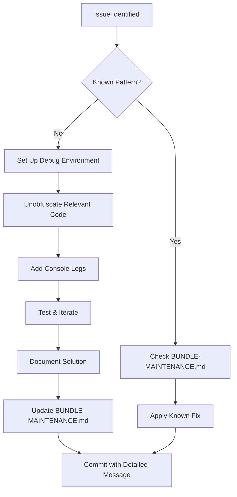

# TradingView Trading Terminal - Bundle Maintenance Guide

**Version**: 2.0.0  
**Last Updated**: January 14, 2026  
**Status**: ✅ Active - Forked & Maintained

---

## ⚠️ Critical: Forked Semi-Bundled Version

This folder contains a **forked semi-bundled version** of TradingView Trading Terminal that we **actively maintain, patch, and evolve**. We have **NO official support** from TradingView and rely on reverse engineering for customizations.

**This is NOT example code** - it is a **production-critical component** of our trading platform.

---

## Contents Overview

### Core Bundle Files (Production)

```
frontend/public/
├── trading_terminal/              # ⭐ CORE COMPONENT - Active maintenance
│   ├── bundles/                   # Minified/obfuscated JavaScript bundles
│   │   ├── order-view-controller.*.js  # Order/Position dialog logic (PATCHED)
│   │   ├── trading.*.js           # Core trading operations
│   │   ├── trading-account-manager.*.js  # Account Manager UI
│   │   └── ... (100+ bundle files)
│   ├── charting_library.d.ts      # TypeScript type definitions
│   ├── broker-api.d.ts            # Broker API types
│   └── datafeed-api.d.ts          # Datafeed API types
│
├── advanced_charting_library/     # Alternative chart library (not currently used)
│
└── datafeeds/                     # TradingView examples (reference only)
    └── udf/                       # UDF protocol examples (NOT USED - we use custom backend)
```

### Status by Component

| Component               | Status                  | Maintenance Level | Git Tracked |
| ----------------------- | ----------------------- | ----------------- | ----------- |
| `trading_terminal/`     | ✅ **Production**       | 🔴 High           | ❌ No       |
| `advanced_charting/`    | 🟡 Available (not used) | ⚪ None           | ❌ No       |
| `datafeeds/` (examples) | 📚 Reference only       | ⚪ None           | ❌ No       |

---

## Maintenance Approach

### Our Engineering Reality

1. **Forked Version**: Semi-bundled TradingView Trading Terminal with custom patches
2. **No Vendor Support**: No official support channel - we're on our own
3. **Reverse Engineering**: Debug obfuscated/minified bundles to understand internals
4. **Selective Patching**: Apply surgical fixes to bundle files when needed
5. **Documentation-Driven**: Comprehensive docs for every patch (see [BUNDLE-MAINTENANCE.md](../docs/tradingview/BUNDLE-MAINTENANCE.md))

### Bundle Modification History

| Date         | Bundle                   | Issue                       | Status | Commit  |
| ------------ | ------------------------ | --------------------------- | ------ | ------- |
| Jan 13, 2026 | order-view-controller.js | Position dialog field sync  | ✅     | 541d023 |
| Jan 13, 2026 | order-view-controller.js | Bracket pre-population bug  | ✅     | 541d023 |
| Oct 27, 2024 | trading_terminal/        | Switch from advanced charts | ✅     | ed323e2 |

**See**: [BUNDLE-MAINTENANCE.md](../docs/tradingview/BUNDLE-MAINTENANCE.md) for detailed case studies.

---

## Key Documentation

### Primary Maintenance Guides

1. **[BUNDLE-MAINTENANCE.md](../docs/tradingview/BUNDLE-MAINTENANCE.md)** ⭐ **START HERE**
   - Debugging methodology for obfuscated bundles
   - RxJS observable patterns in TradingView code
   - Case studies of actual bundle fixes
   - Unobfuscation techniques
   - Preservation best practices

2. **[TYPE-DEFINITIONS.md](../docs/tradingview/TYPE-DEFINITIONS.md)**
   - TypeScript type reference (`charting_library.d.ts`, `broker-api.d.ts`)
   - Type usage patterns
   - Core interfaces (Order, Position, Execution, PreOrder)
   - Enum definitions (OrderStatus, OrderType, Side)

3. **[BROKER-CONNECTION-ADAPTER.md](../docs/tradingview/BROKER-CONNECTION-ADAPTER.md)**
   - Trading Host API (`IBrokerConnectionAdapterHost`)
   - Event-driven architecture
   - Reactive values (`IWatchedValue`)
   - UI update mechanisms

4. **[UI-USAGE-GUIDE.md](../docs/tradingview/UI-USAGE-GUIDE.md)**
   - TradingView UI interaction patterns
   - Playwright testing strategies
   - Order placement workflows

### Integration Documentation

- **[BROKER-INTEGRATION.md](../docs/BROKER-INTEGRATION.md)** - Complete broker service integration
- **[WEBSOCKET-ARCHITECTURE.md](../docs/WEBSOCKET-ARCHITECTURE.md)** - Real-time data integration
- **[ERROR-MANAGEMENT.md](../docs/ERROR-MANAGEMENT.md)** - Error handling patterns

---

## Bundle Maintenance Workflow

### When You Need to Modify a Bundle



### Debug Environment Setup

```bash
# 1. Locate the bundle file
cd frontend/public/trading_terminal/bundles/

# 2. Find the target file (usually order-view-controller.*.js)
ls -lh order-view-controller*

# 3. Use unminify tools or manual beautification
# - Search for class/function patterns
# - Add readable comments above minified code
# - Insert console.log statements for debugging

# 4. Test in browser dev tools
# - Set breakpoints
# - Watch observable streams
# - Trace RxJS operators
```

### Preservation Rules

1. **NEVER delete original code** - Always preserve the original minified version
2. **Add comments** - Document your understanding above/beside original code
3. **Console logs** - Keep debug logs as comments for future reference
4. **Git commit** - Every bundle modification gets a dedicated commit with detailed message
5. **Update docs** - Add case study to BUNDLE-MAINTENANCE.md

---

## Common Debugging Patterns

### RxJS Observable Issues

**Problem**: Observables not emitting, `combineLatest` not firing

**Solution**: Check for missing `startWith()` operators

```javascript
// ❌ BROKEN: fromEventPattern without initial emission
this._equity$ = fromEventPattern(subscribeEquity)

// ✅ FIXED: Add startWith() for immediate emission
this._equity$ = fromEventPattern(subscribeEquity).pipe(startWith(NaN))
```

**Reference**: [BUNDLE-MAINTENANCE.md Case Study 2](../docs/tradingview/BUNDLE-MAINTENANCE.md#case-study-2-position-dialog-field-sync-bug)

### Dialog Sync Issues

**Problem**: Fields not updating in Order/Position dialogs

**Key Classes**:

- `Pt` - PositionViewModel (order-view-controller.js ~line 5500)
- `bt` - OrderViewModel (order-view-controller.js ~line 3800)
- `ie` - BracketModel

**Debug Approach**:

1. Search for class definition by pattern (e.g., `class Pt{constructor(`)
2. Locate observable streams (`_quotes$`, `_equity$`, etc.)
3. Check `combineLatest` subscriptions
4. Verify `startWith()` operators on all observables

---

## Integration Points

### How We Use TradingView Bundles

```typescript
// 1. Import types from bundle type definitions
import type {
  PlacedOrder,
  Position,
  PreOrder,
  OrderStatus,
  OrderType,
  Side,
} from '@public/trading_terminal/charting_library'

// 2. Initialize Trading Terminal in component
import { widget } from '@public/trading_terminal/charting_library'

const tradingTerminal = new widget({
  library_path: '/trading_terminal/',
  // ... configuration
  broker_factory: (host) => new BrokerTerminalService(host),
})
```

**See**: [TraderChartContainer.vue](../src/components/TraderChartContainer.vue)

### Custom Backend Integration (NOT UDF)

We **DO NOT** use TradingView's UDF (Universal Data Feed) protocol. Instead:

```typescript
// Our custom datafeed implementation
// Location: frontend/src/services/datafeedService.ts

// Backend endpoints (FastAPI custom routes):
GET /api/v1/datafeed/history      // Historical bars
GET /api/v1/datafeed/search       // Symbol search
GET /api/v1/datafeed/symbols      // Symbol info
WS  /ws (topic: bars:SYMBOL:RESOLUTION)  // Real-time bars
```

**Advantage**: Type-safe OpenAPI-generated clients, WebSocket real-time updates, unified API

---

## Exclusion Configuration

### What's Excluded from Git

```gitignore
# .gitignore
frontend/public/trading_terminal/
frontend/public/advanced_charting_library/
frontend/public/datafeeds/
```

**Why**: Binary/minified bundles (100+ files) would bloat repository. We document patches instead.

**Risk**: Bundle modifications are NOT version-controlled. **MUST document all changes comprehensively**.

### What's Excluded from Linting/Type-Checking

**ESLint** (`eslint.config.ts`):

```typescript
ignores: [
  'public/trading_terminal/**',
  'public/advanced_charting_library/**',
  'public/datafeeds/**',
]
```

**TypeScript** (`tsconfig.json`):

```json
{
  "exclude": ["public/trading_terminal", "public/advanced_charting_library", "public/datafeeds"]
}
```

**Vitest** (`vitest.config.ts`):

```typescript
exclude: [
  '**/public/trading_terminal/**',
  '**/public/advanced_charting_library/**',
  '**/public/datafeeds/**',
]
```

**See**: [FRONTEND-EXCLUSIONS.md](../docs/FRONTEND-EXCLUSIONS.md) for complete configuration reference.

---

## Upgrade Strategy

### When New TradingView Version Available

⚠️ **DANGER ZONE**: Upgrading bundles **WILL BREAK** our patches.

**Pre-Upgrade Checklist**:

1. ✅ Document all current patches in BUNDLE-MAINTENANCE.md
2. ✅ Create backup of current bundle directory
3. ✅ Review bundle modification git history
4. ✅ Export all patch code snippets
5. ✅ Test current functionality comprehensively

**Upgrade Process**:

```bash
# 1. Backup current bundles
cp -r frontend/public/trading_terminal/ /tmp/trading_terminal_backup_$(date +%Y%m%d)/

# 2. Extract patch locations from docs
grep "Line [0-9]" frontend/docs/tradingview/BUNDLE-MAINTENANCE.md

# 3. Replace bundles with new version
# (Manual step - depends on TradingView delivery method)

# 4. Re-apply patches
# - Use BUNDLE-MAINTENANCE.md as reference
# - Search for similar patterns in new bundles
# - May require significant debugging if structure changed

# 5. Comprehensive testing
# - Order dialog functionality
# - Position dialog field sync
# - Bracket order handling
# - Account manager UI
```

**Post-Upgrade**:

1. Update BUNDLE-MAINTENANCE.md with new line numbers/patterns
2. Update this README with new bundle file names (hash changes)
3. Document any new issues discovered
4. Commit all changes with detailed message

---

## Testing Modified Bundles

### Browser DevTools Strategy

1. **Open DevTools** → Sources tab
2. **Navigate to** `frontend/public/trading_terminal/bundles/`
3. **Set breakpoints** in modified functions
4. **Test scenarios**:
   - Place order with bracket
   - Edit position (check field sync)
   - Modify order
   - Cancel order

### Console Debugging

```javascript
// Add temporary debugging in bundle files
console.log('[DEBUG] PositionViewModel._equity$ emitted:', value)
console.log('[DEBUG] combineLatest fired with:', [quotes, equity, instrument])
```

**Remember**: Keep these logs as comments after debugging for future reference.

### End-to-End Tests

**Location**: `smoke-tests/tests/broker-integration.spec.ts`

```bash
# Run E2E tests after bundle modifications
cd smoke-tests/
npm run test
```

---

## Known Issues & Workarounds

### Issue 1: Position Dialog Field Sync

**Status**: ✅ RESOLVED (January 13, 2026)

**Problem**: Price/Ticks/$ fields don't auto-sync in position edit dialog

**Solution**: Added `startWith()` operators to `_quotes$` and `_equity$` observables in `Pt` class

**File**: `order-view-controller.*.js` (Lines 5506-5523)

**Reference**: [BUNDLE-MAINTENANCE.md Case Study 2](../docs/tradingview/BUNDLE-MAINTENANCE.md#case-study-2-position-dialog-field-sync-bug)

### Issue 2: Bracket Pre-Population

**Status**: ✅ RESOLVED (January 13, 2026)

**Problem**: Bracket orders not pre-populating in position dialog

**Solution**: Modified bracket preset initialization in position dialog controller

**Reference**: [BUNDLE-MAINTENANCE.md Case Study 1](../docs/tradingview/BUNDLE-MAINTENANCE.md#case-study-1-position-bracket-pre-population-bug)

---

## Future Refactoring Plans

### Potential Improvements

1. **Extract Core Logic**: Identify reusable patterns from bundles → create wrapper services
2. **Type Safety Layer**: Build TypeScript facade over modified bundle functions
3. **Test Harness**: Isolated testing environment for bundle modifications
4. **Patch Automation**: Scripts to apply known patches after upgrades

### Contributing to Maintenance

When you discover/fix a new bundle issue:

1. **Document thoroughly** - Add case study to BUNDLE-MAINTENANCE.md
2. **Code comments** - Explain the fix in comments within the bundle
3. **Update this README** - Add to "Known Issues" section
4. **Test comprehensively** - Add E2E test if applicable
5. **Git commit** - Detailed message explaining the problem, investigation, and solution

---

## External Resources

### TradingView Official Docs (Limited Applicability)

⚠️ **Note**: Official docs are for **supported** integrations. Many patterns don't apply to our forked bundle approach.

- **Trading Terminal Docs**: https://www.tradingview.com/charting-library-docs/latest/trading_terminal/
- **Broker API Reference**: https://www.tradingview.com/charting-library-docs/latest/api/interfaces/Charting_Library.IBrokerTerminal/
- **Trading Host API**: https://www.tradingview.com/charting-library-docs/latest/api/interfaces/Charting_Library.IBrokerConnectionAdapterHost/

**Use Case**: Understanding intended API surface, not implementation details (bundles are obfuscated).

### Our Documentation (Authoritative)

For our actual implementation and bundle modifications, **always refer to our internal docs**:

- **[docs/tradingview/](../docs/tradingview/)** - Complete TradingView integration guide
- **[BUNDLE-MAINTENANCE.md](../docs/tradingview/BUNDLE-MAINTENANCE.md)** - Primary maintenance reference
- **[BROKER-INTEGRATION.md](../docs/BROKER-INTEGRATION.md)** - Service-level integration
- **[DOCUMENTATION-GUIDE.md](../../docs/DOCUMENTATION-GUIDE.md)** - Full project documentation index

---

## Quick Reference

### Critical Files

| File Path                         | Purpose                            | Maintenance |
| --------------------------------- | ---------------------------------- | ----------- |
| `trading_terminal/bundles/`       | All bundle JavaScript files        | 🔴 High     |
| `trading_terminal/*.d.ts`         | TypeScript type definitions        | 🟢 Stable   |
| `datafeeds/` (examples)           | TradingView examples (not used)    | ⚪ None     |
| `advanced_charting_library/`      | Alternative library (not used)     | ⚪ None     |
| `../docs/tradingview/`            | Our maintenance documentation      | 🔴 High     |
| `../src/services/brokerTerminal*` | Service layer integration          | 🔴 High     |
| `../src/services/datafeedService` | Custom datafeed (not UDF)          | 🟡 Medium   |
| `../src/components/TraderChart*`  | Vue component wrapping TradingView | 🟡 Medium   |

### Command Reference

```bash
# Find a bundle file
ls -lh frontend/public/trading_terminal/bundles/order-view-controller*

# Search for pattern in bundle
grep -n "class Pt{" frontend/public/trading_terminal/bundles/order-view-controller*.js

# View bundle modification history
git log --oneline -- frontend/public/trading_terminal/bundles/

# Run E2E tests
cd smoke-tests && npm run test

# Start dev environment (frontend serves public/ assets)
make -f project.mk dev-frontend
```

---

## Summary

This is **NOT** a standard TradingView integration. We maintain a **forked, patched, reverse-engineered version** of the Trading Terminal with:

- ✅ **Active maintenance** of obfuscated bundle files
- ✅ **Comprehensive documentation** of every modification
- ✅ **Custom backend integration** (no UDF protocol)
- ✅ **Type-safe TypeScript** layer over bundles
- ✅ **E2E testing** coverage
- ⚠️ **No vendor support** - we're on our own
- ⚠️ **Upgrade risk** - patches break on version updates

**For all maintenance work, always start with**: [BUNDLE-MAINTENANCE.md](../docs/tradingview/BUNDLE-MAINTENANCE.md)

---

**Last Updated**: January 14, 2026  
**Maintained by**: Development Team  
**Status**: ✅ Active Production Component - Forked & Evolving
